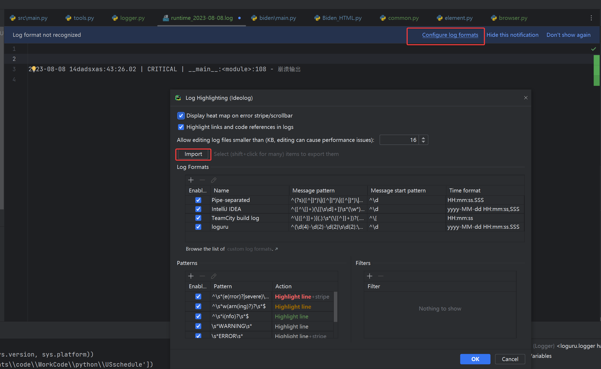

# 美国外交数据库项目
## 1. 文件夹说明
```shell

```
所有代码都放在src目录下
所有结果都保存在
## 2. 输出结果保存建议
每一个步骤的分步结果单独保存为bak文件，下一个步骤用只读方式打开该备份文件
```shell
    # 比如：第一步的输出结果为output1.txt，在输出完成后，将output1.txt重命名为output1.txt.bak
    1.py -o output1.txt
    cp output1.txt output1.txt.bak
    2.py -i output1.txt.bak -o output2.txt
```

## 3. 最终输出文件定义

| 列名            | 含义                     |
| --------------- | ------------------------ |
| Date            | 日期                     |
| President       | 总统名称                 |
| article_link    | 该日期下发布的文章链接   |
| article_html    | 该日期下发布的文章的内容 |
| article_content | 该日期下发布的文章内容   |

## 4. loguru配置

loguru是一个python日志库，可以格式化输出日志。pycharm也有一个ideolog插件，该插件可以讲.log结尾的文件里的日志文本进行色彩调整。

ideolog插件默认不支持loguru的格式，可以在ideolog插件里导入以下xml来识别loguru日志库的输出。

将下面的xml复制保存为Loguru.xml

```xml
<State>
  <highlightingPatterns>
    <LogHighlightingPattern enabled="true" pattern="^\s*s(uccess)?\s*$" action="HIGHLIGHT_LINE" fg="-10316203" bold="false" italic="false" stripe="false" uuid="2dd936f0-fc0f-4b96-9a14-583e22c220c5" />
  </highlightingPatterns>
  <hiddenSubstrings />
  <parsingPatterns>
    <LogParsingPattern enabled="true" name="loguru" pattern="^(\d{4}-\d{2}-\d{2}\s\d{2}:\d{2}:\d{2}\.\d{3}\s)\|(\s[A-Z]*\s*)\|(\s.+:.+:\d+\s-\s.*)$" timePattern="yyyy-MM-dd HH:mm:ss.SSS" linePattern="^\d" timeId="0" severityId="1" categoryId="2" fullmatch="false" uuid="19dd1738-1dc7-4df6-b437-18e0800b7782" />
  </parsingPatterns>
  <settingsVersion>7</settingsVersion>
  <lastAddedDefaultFormat>b5772998-bf1e-4d9d-ab41-da0b86451163,8a0e8992-94cb-4f4c-8be2-42b03609626b,e9fa2755-8390-42f5-a41e-a909c58c8cf9</lastAddedDefaultFormat>
  <errorStripeModel>heatmap</errorStripeModel>
  <readonlySizeThreshold>16</readonlySizeThreshold>
  <highlight_links>true</highlight_links>
</State>
```

然后按照下图进行导入，即可识别



日志类的使用：

```python
from util.logger import Logger

logger = Logger().get_logger

logger.debug('调试代码')
logger.info('输出信息')
logger.success('输出成功')
logger.warning('错误警告')
logger.error('代码错误')
logger.critical('崩溃输出')
```

